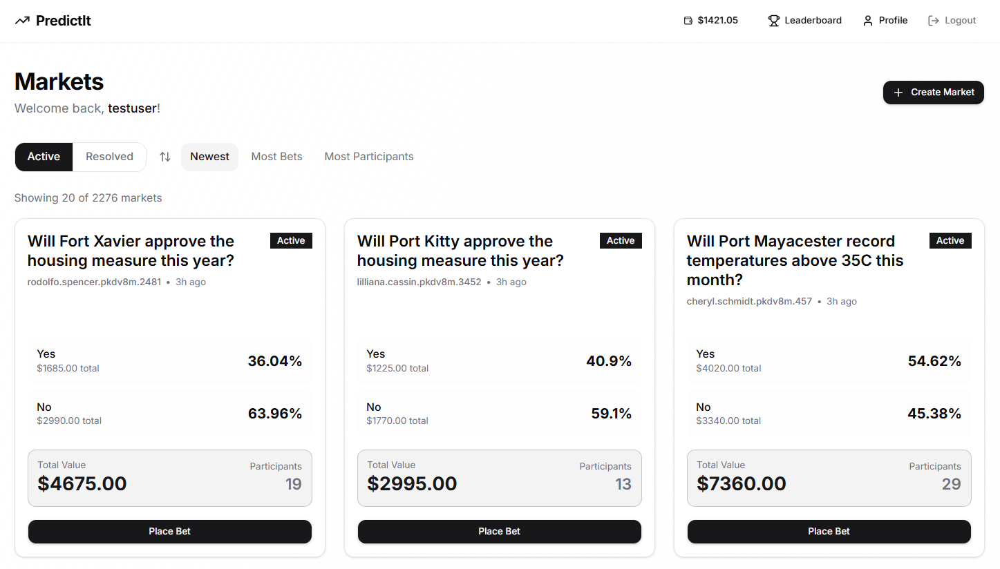
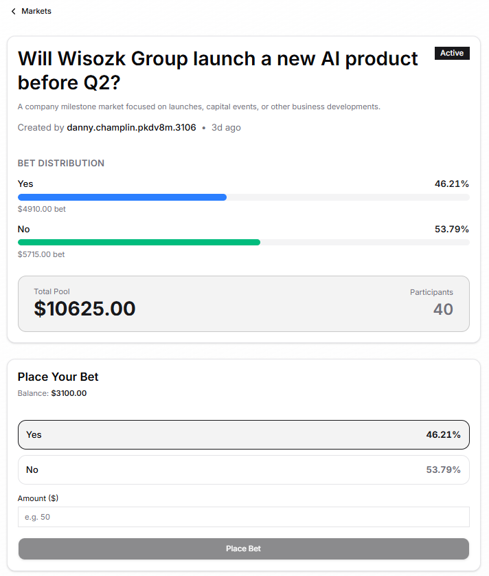
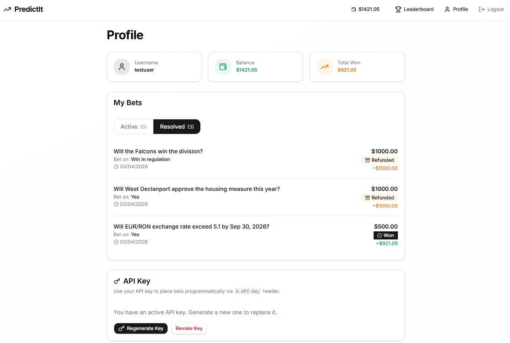
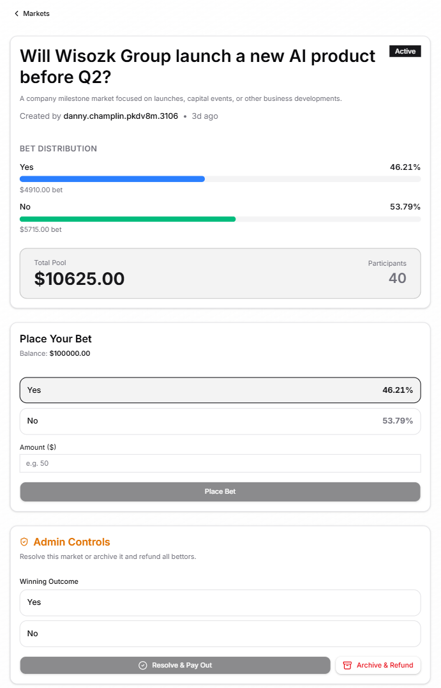

# Submission - PredictIt Platform

## Short Description

PredictIt is a real-time **Prediction Market Platform** built with **Bun, Elysia, and React 19**.

Key features implemented on top of the initial scaffold:
- **Real-time Dashboard:** Live odds and market volume via Server-Sent Events (SSE).
- **Balance & Payouts:** Atomic transactions for bet placement and proportional payout distribution on resolution.
- **Filtering, Sorting & Pagination:** 20 markets/page with full control over sort field and direction.
- **Admin Control Suite:** Resolve markets, archive with refund, and automatic winner payout.
- **Bot-ready API:** Programmatic access via secure API Keys (`X-API-Key` header).
- **UI/UX:** Skeleton loaders, CSS-only progress bars for bet distribution, and React error boundaries.

**To run:** `docker compose up --build` → frontend at `localhost:3000`, API at `localhost:4001`.

## Images or Video Demo

**Video Demo:** [Click here to watch the Video Demo](https://drive.google.com/file/d/1vB05zufuhNueIwN8sPiOMaHNq3N-OarT/view?usp=sharing)

**Screenshots:**

*1. Dashboard: Filtering, sorting, and pagination of active prediction markets.*

*2. Market Details: Real-time odds and CSS-driven bet distribution progress bars.*

*3. User Profile: Balance tracking, active/resolved bets history, and API Key generation.*

*4. Admin View: Exclusive controls for resolving outcomes or archiving markets.*
